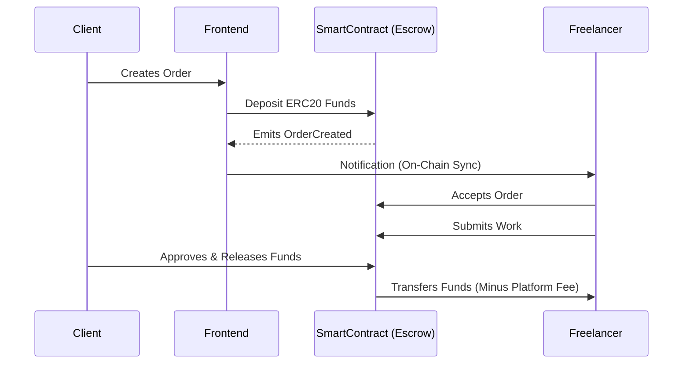

# TrustGrow - Decentralized Web3 Escrow Marketplace 🌐🛡️

> **The ultimate trust layer for freelance work.** Secure, decentralized, and transparent payments powered by smart contracts on the Ethereum blockchain.

---

## 🌟 Overview

**TrustGrow** bridges the gap between freelancers and clients by eliminating the need for a centralized middleman. Using Ethereum smart contracts, TrustGrow locks client funds in escrow and only releases them when the work is approved.

Built to be a **robust portfolio piece**, TrustGrow demonstrates full-stack Web3 capabilities from writing secure smart contracts to a sleek, modern Next.js UI using `ethers.js` to interact with the blockchain.

---

## ✨ Key Features

- **🔒 Trustless Escrow:** Funds are securely locked on-chain in an OpenZeppelin-secured smart contract.
- **💼 Escrow Management:** Clients and freelancers can manage their orders directly from the blockchain dashboard.
- **🔔 Real-Time Toast Notifications:** Instant feedback for transaction success and error states using `react-hot-toast`.
- **⚖️ Admin Dispute Resolution:** If things go wrong, an admin can arbitrate disputes and route funds securely on-chain.

---

## 🏗️ Architecture & Workflow

Here is how TrustGrow manages the lifecycle of a freelance agreement:



---

## 💻 Tech Stack

### Frontend
- **Framework:** Next.js (React 18)
- **Styling:** Tailwind CSS (Modern, glassmorphism UI)
- **Blockchain Interaction:** ethers.js v6
- **Notifications:** react-hot-toast

### Smart Contracts
- **Contract Framework:** Hardhat
- **Language:** Solidity `^0.8.20`
- **Security:** OpenZeppelin (`ReentrancyGuard`, `Pausable`, `SafeERC20`)

---

## 🚀 Getting Started

### Prerequisites
- Node.js (v18+)
- MetaMask extension installed

### 1. Smart Contract Setup
```bash
cd "smart contract"
npm install
npx hardhat compile
npx hardhat node # Start local blockchain
```

### 2. Frontend Setup
```bash
cd frontend
npm install
npm run dev
```

Open [http://localhost:3000](http://localhost:3000) to view the application.

---

## 📜 License
This project is open-source and available under the **MIT License**.
