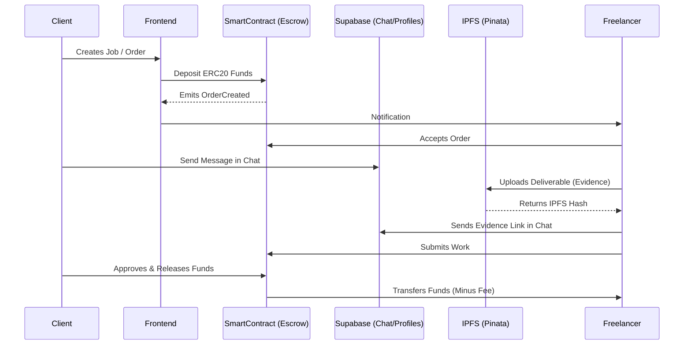

# TrustGrow - Decentralized Web3 Escrow Marketplace 🌐🛡️

> **The ultimate trust layer for freelance work.** Secure, decentralized, and transparent payments powered by smart contracts, decentralized identity (Supabase), and decentralized storage (IPFS/Pinata).

---

## 🌟 Overview

**TrustGrow** bridges the gap between freelancers and clients by eliminating the need for a centralized middleman. Using Ethereum smart contracts, TrustGrow locks client funds in escrow and only releases them when the work is approved.

Built to be a **100/100 portfolio piece**, TrustGrow demonstrates full-stack Web3 capabilities from writing secure smart contracts with Hardhat to a sleek, modern Next.js UI using real-time database syncing and IPFS integration.

---

## ✨ Key Features

- **🔒 Trustless Escrow:** Funds are securely locked on-chain in an OpenZeppelin-secured smart contract.
- **💬 Real-Time Chat & Evidence:** Built-in chat using **Supabase Realtime**, allowing clients and freelancers to communicate instantly on an order.
- **📎 IPFS File Storage:** Upload evidence, documents, and work deliverables permanently using **Pinata** (IPFS).
- **👤 Decentralized Identity (Profiles):** Users can customize their names and avatars (using Supabase), abstracting away ugly wallet addresses.
- **💼 Open Jobs Marketplace:** A dedicated marketplace board where clients can post jobs and freelancers can browse opportunities.
- **🔔 Real-Time Toast Notifications:** Instant feedback for transaction success, chat messages, and error states using `react-hot-toast`.
- **⚖️ Admin Dispute Resolution:** If things go wrong, an admin can arbitrate disputes by viewing chat logs and IPFS evidence.

---

## 🏗️ Architecture & Workflow

Here is how TrustGrow manages the lifecycle of a freelance agreement:



---

## 💻 Tech Stack

### Frontend
- **Framework:** Next.js (React 18)
- **Styling:** Tailwind CSS (Modern, glassmorphism UI)
- **Blockchain Interaction:** ethers.js v6
- **Real-Time Database:** Supabase Realtime (PostgreSQL)
- **Notifications:** react-hot-toast

### Smart Contracts & Backend
- **Contract Framework:** Hardhat
- **Language:** Solidity `^0.8.20`
- **Security:** OpenZeppelin (`ReentrancyGuard`, `Pausable`, `SafeERC20`)
- **Decentralized Storage:** Pinata (IPFS API)
- **Testing:** Mocha, Chai (Full coverage)

---

## 🚀 Getting Started

### Prerequisites
- Node.js (v18+)
- MetaMask extension installed
- Supabase Account (for Chat & Profiles)
- Pinata Account (for IPFS)

### 1. Smart Contract Setup
```bash
cd "smart contract"
npm install
npx hardhat compile
npx hardhat test # Run the smart contract test suite
npx hardhat node # Start local blockchain
```

### 2. Frontend Setup
```bash
cd frontend
npm install
# Create a .env.local file with your Supabase & Pinata API keys
npm run dev
```

Open [http://localhost:3000](http://localhost:3000) to view the application.

---

## 🧪 Smart Contract Testing

TrustGrow comes with a robust test suite for `Escrow.sol`, covering:
- ✅ Order Creation & Validation
- ✅ Full Flow (Creation -> Accept -> Submit -> Approve & Release)
- ✅ Fee calculations and distribution
- ✅ Dispute Resolution (Client & Freelancer rulings)

To run the tests:
```bash
cd "smart contract"
npx hardhat test
```

---

## 📜 License
This project is open-source and available under the **MIT License**.
